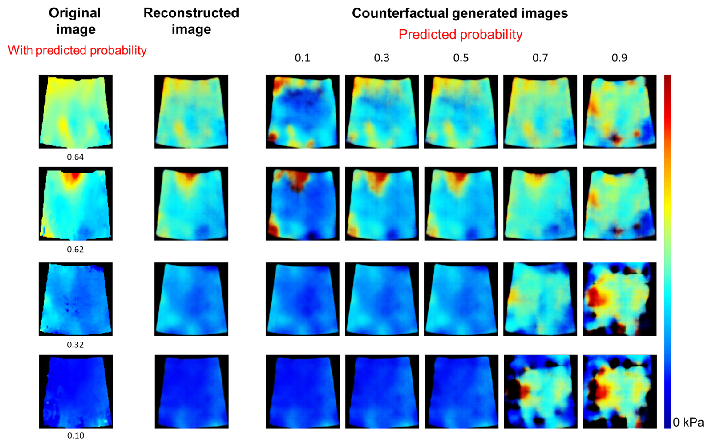

## README.md

This repository provides Python scripts for generating counterfactual explanations using a VAE (Variational Autoencoder) and an MLP (Multi-Layer Perceptron). These counterfactuals provide insights into decisions made by a trained MLP model, specifically designed for the classification of posthepatectomy liver failure (PHLF) using 2D Shear Wave Elastography images.

### Directory Structure:

- `generate_latent.py`: Python script for generating the latent space representation of the images using a VAE model.
- `train_mlp.py`: Python script for training a multi-layer perceptron (MLP) model for classification.
- `config.py`: Configuration file with all the options/parameters used in the scripts.
- `counterfactuals`: Directory containing the generated counterfactual images.

### Requirements:

Install the necessary libraries using pip:
```bash
pip install -r requirements.txt
```

### Configuration File (`config.py`):

In the `config.py` file, you can find and adjust the necessary parameters and options for VAE and MLP models, and counterfactual generation. Modify the parameters according to your needs and computational resources.

### Usage

#### Step 1: Generate Latent Space Representation
```bash
python generate_latent.py
```
This command uses a Variational Autoencoder (VAE) model to generate the latent space representation of Shear Wave Elastography images.

#### Step 2: Train MLP for Classification
```bash
python train_mlp.py
```
This command trains an MLP model for the task of PHLF classification.

#### Step 3: Generate Counterfactuals
The counterfactuals are generated within the `train_mlp.py` script. These images represent how the input would need to change to affect the model's output decision. This repo is still under-development.

### Example

After running the steps above, you can examine the counterfactual images in the `counterfactuals` directory. For instance, for an original image 'image1.png', a counterfactual image 'image1_0.75.png' shows the modifications needed in the original image to achieve a classification probability of 0.75.



**Note:** This README provides a high-level overview of the process. The specific paths and settings in the `config.py` file need to be configured according to your specific dataset and computational resources.
